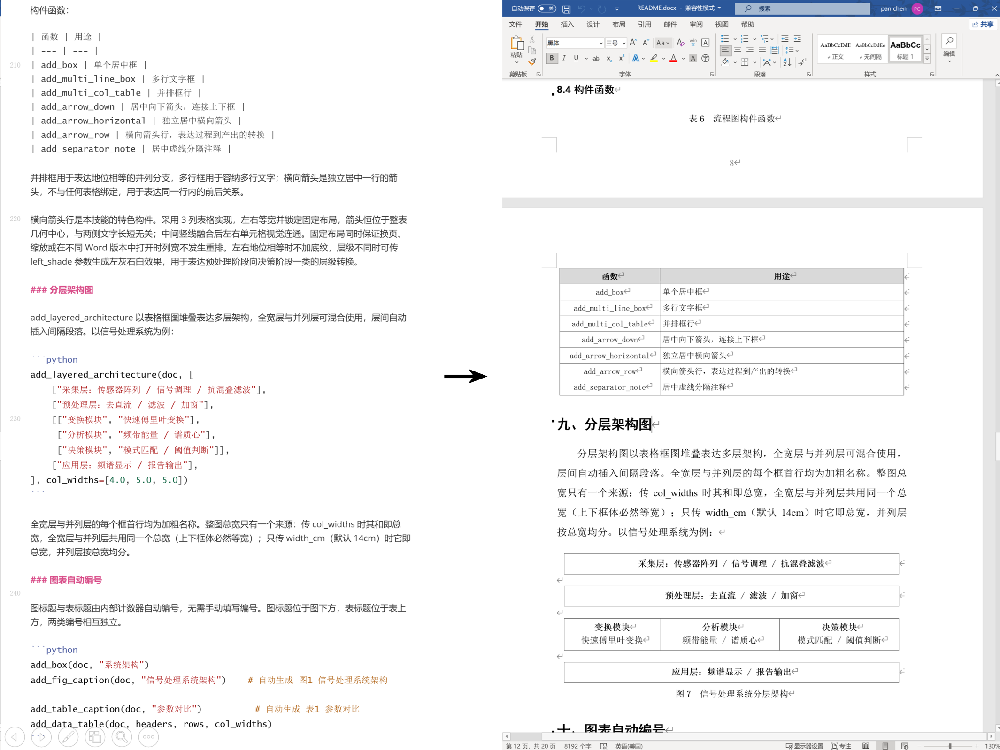

# docx-formatter 中文 Word 专业排版技能


docx-formatter 生成专业排版的中文 Word 文档，覆盖章节结构、正文、数学公式、表格、流程图、目录、引用上标与文档验证的完整排版链路，输出符合学术与工程规范的 .docx 文件。排版效果可参考仓库中的 README.docx 与 README.pdf。



*图：左侧为 README.md 源码，右侧为同一内容经本技能排版生成的 README.docx。*

技能采用单引擎架构，仅依赖 Python 3.8 以上版本与 python-docx。数学公式由 ommlBuilders.py 直接生成 OMML XML，即 Word 原生公式格式，公式在 Word 中可二次编辑，无需 Node.js 或任何外部转换工具。

## 功能矩阵

技能共包含 20 个模块，其中 13 个默认启用，2 个按需生成，5 个为可选模块，仅在明确要求时启用。

| 模块 | 默认状态 | 说明 |
| --- | --- | --- |
| 标准排版 | 启用 | 标题、正文、缩进与行距体系 |
| 排版预设 | 启用 | 整套切换排版参数，支持中西文字体分离 |
| OMML 数学公式 | 启用 | 行内与块级公式，Word 原生可编辑 |
| 引用上标 | 启用 | 参考文献标记自动渲染为上标 |
| 参考文献列表 | 启用 | GB/T 7714-2015 顺序编码制文献表 |
| 表格框图流程图 | 启用 | 表格与 Unicode 箭头构建流程图 |
| 分层架构图 | 启用 | 多层架构的表格框图堆叠 |
| 图表自动编号 | 启用 | 图表标题自动递增编号 |
| 代码块 | 启用 | 等宽字体与浅灰底纹 |
| 数据表 | 启用 | 灰色表头与固定列宽 |
| 单元格公式 | 启用 | 表格单元格内插入行内公式 |
| 轻量文档验证 | 启用 | 纯标准库 5 项检查，生成后默认执行 |
| 安全解压与重打包 | 启用 | 编辑现有文档的安全基础 |
| 目录生成 | 按需 | Heading 样式加目录域，末尾分节触发正文页码从 1 起算 |
| 封面页 | 按需 | 居中标题块，顶部留白按版心比例自动适配 |
| PDF 渲染验证 | 可选 | Windows 调用本机 Word 渲染，其他平台调用 LibreOffice |
| XSD 模式验证 | 可选 | OOXML 标准深度验证 |
| 编辑现有文档 | 可选 | 解压、编辑与重打包工作流 |
| 追踪修订 | 可选 | 接受全部追踪修订 |
| 批注管理 | 可选 | 批注插入与交叉链接维护 |

## 如何开始

本技能为函数库，不含可执行入口：docxBuilder.py 无 main() 函数，直接运行不产生任何输出。Agent 生成文档的方式是编写调用脚本，导入库函数后按文档结构依次调用。

Agent 生成文档前应先阅读 scripts/buildReadmeDocx.py。该文件是本技能的标准骨架，从 setup_document() 到 doc.save() 的完整调用顺序均在其正文示范；它同时用于生成项目根目录的 README.docx，因而始终与库保持同步。

| 参考文件 | 用途 |
| --- | --- |
| scripts/buildReadmeDocx.py | 标准骨架范例，覆盖封面、目录、标题、正文、分点、公式、数据表、流程图、图表标题与参考文献的完整调用顺序 |
| SKILL.md | 各函数的完整参数说明、排版数值、规则与陷阱 |
| scripts/docxBuilder.py | 函数库本体与预设值，用于确认实现细节 |

标准流程为：Agent 阅读 buildReadmeDocx.py 的 import 段与调用顺序，复制 docxBuilder.py 到工作目录（文档含公式时再加 ommlBuilders.py 与 formulaTemplates.py），新建调用脚本并按范例顺序写入内容，运行后用 docxValidator.py 验证。

## 核心模块

### 标准排版

标题使用黑体，正文使用宋体。文档标题一号 26pt 居中加粗，一级标题三号 16pt 左对齐，二级与三级标题小四 12pt。正文小四 12pt 两端对齐，首行缩进 2 字符，全文 1.5 倍行距。纸张为 A4，页边距上下 2.54cm、左右 3.18cm。分级页码：封面与目录不显示页码，正文从第 1 页起算，页脚居中放置五号 Times New Roman 的 PAGE 域。封面页的居中标题块由顶部留白定位，留白高度按版心高比例换算，换纸张或页边距时自动等比适配。各级标题的字体、字号、加粗与黑色统一写在 Word 内置 Heading 样式上，标题文字本身不带直接字符格式；这样既覆盖了样式默认的蓝色与模板主题字体引用，也让 Word 更新目录域时无法把标题字体搬进条目，目录条目因而严格按样式呈现。中西文字体分离：正文西文用 Times New Roman 衬线体，标题西文用 Arial 无衬线体，对齐 NJUThesis 的字体族设计。

| 函数 | 用途 |
| --- | --- |
| setup_document | 创建文档并应用页面设置，自动重置图表计数器 |
| add_cover_page | 封面页，居中标题块并用顶部留白定位，独立成节且不显示页码 |
| add_title | 不放封面时的文档主标题，黑体三号居中加粗 |
| add_h1、add_h2、add_h3 | 一级、二级、三级标题，使用 Word 内置 Heading 样式，可进入目录 |
| add_body | 正文段落，支持加粗标记与引用上标 |
| add_item_para | 加粗标签加分点内容的段落，标签整体加粗 |

```python
from docxBuilder import setup_document, add_title, add_h1, add_body

doc = setup_document()
add_title(doc, "信号分析实验报告")
add_h1(doc, "一、实验目的")
add_body(doc, "本实验验证傅里叶分析方法在周期信号处理中的有效性。")
```

### 排版预设

排版参数集中在 docxBuilder.py 顶部的 PRESETS 字典中，按标题、正文、分点、图注、页面、目录、封面等分组管理，各排版函数统一读取当前激活的预设。

- set_preset 整套切换排版参数，须在 setup_document 之前调用，默认预设与标准排版一致
- 新增预设只需向 PRESETS 追加一份同结构的嵌套字典
- 支持中西文字体分离，开启后西文使用 Times New Roman，中文保持原有字体不变
- 封面留白比例位于预设的封面分组内，留白高度由它乘以版心高得出，换纸张与页边距时封面位置随之等比适配

### OMML 数学公式

公式构建器提供一组组合函数，直接生成 OMML XML 并插入文档，产物为 Word 原生可编辑公式，与手动插入的公式完全一致。对于分式套分式、双重求和、函数嵌套的复杂结构，构建函数可任意组合。

| 构建函数 | 用途 |
| --- | --- |
| r | 纯数学文本，自动转义 XML 特殊字符 |
| sub | 下标，如 a 的下标 k |
| sup | 上标，如 x 的平方 |
| frac | 分式 |
| sumOp | 求和符号，下标结构配合 Unicode ∑，规避空上标渲染异常 |
| func | 函数名加参数，如 cos 与 exp |
| paren | 圆括号结构 |
| bracket | 方括号结构 |
| math | 块级公式，居中独立成行 |
| inlineMath | 行内公式，与正文混排 |

块级公式以傅里叶级数为例：

```python
from docxBuilder import add_eq_para
from ommlBuilders import r, sub, frac, sumOp, func, math

add_eq_para(doc, math([
    r("f(t) = "),
    frac([sub("a", "0")], [r("2")]),
    r(" + "),
    sumOp([r("k")], [sub("a", "k"), func("cos", [r("k"), r("ωt")])]),
]))
```

渲染结果为 Word 原生可编辑公式（markdown 无法渲染 OMML，下方一行是纯文本近似示意，不是输入语法；实际渲染效果见仓库中的 README.docx）：

> f(t) = a₀/2 + Σₖ aₖ cos(kωt)

行内公式与正文混排：

```python
from docxBuilder import add_body_with_math
from ommlBuilders import sub, inlineMath

add_body_with_math(doc, [
    ("text", "其中，"),
    ("math", inlineMath([sub("a", "k")])),
    ("text", "为傅里叶系数，其数值由欧拉公式确定。"),
])
```

formulaTemplates.py 内置若干常用公式模板，是现成的 OMML 公式对象，导入即可插入文档，无需重新拼装构建函数，也可作为自定义公式的参考模式。希腊字母与数学符号以 Unicode 直接书写，如 λ、τ、α、β、∑、×、·、∈。

求和符号必须使用 sumOp 构建。求和若采用 n 元运算符加空上标的写法，Word 会渲染一个不可见的上标占位框，导致文件看起来损坏；sumOp 改用下标结构配合 Unicode ∑ 实现，彻底规避该问题。所有接收子元素的函数内部自动展平嵌套列表，防止 XML 拼接错误。

### 引用上标

正文中的参考文献标记自动渲染为上标，适用于 add_body 与 add_item_para，支持三种格式：

| 格式 | 示例 |
| --- | --- |
| 单个引用 | [1] |
| 多个引用 | [1,2] 或 [1, 2] |
| 范围引用 | [1-3] |

```python
add_body(doc, "傅里叶分析方法在信号处理任务中表现出色[1]。后续研究[2,3]进一步验证了这一结论。")
```

### 参考文献列表

add_bibliography 生成 GB/T 7714-2015 顺序编码制参考文献表，格式对齐 NJUThesis LaTeX 模板，与正文引用上标配套使用：正文中的 [1] 指向条目列表第一项，以此类推。

- 章节标题：黑体三号加粗居中，使用 Heading 1 样式，进入目录
- 条目：宋体五号，两端对齐，1.5 倍行距，悬挂缩进 2 字符，折行后与序号后文字对齐
- 序号：[1]、[2] 按传入顺序自动生成，无需手写

```python
add_bibliography(doc, [
    "张三, 李四. 示例期刊论文题名[J]. 示例期刊, 2020, 12(3): 45-56",
    "王五. 示例图书题名[M]. 示例市: 示例出版社, 2019",
    "赵六. 示例学位论文题名[D]. 示例市: 示例大学, 2021",
    "钱七. 示例会议论文题名[C]//示例会议论文集. 示例市: 示例出版社, 2022: 78-85",
    "示例标准化技术委员会. 示例标准题名: 示例标准编号[S]. 示例市: 示例出版社, 2018",
    "孙八. 示例网页题名[EB/OL]. (2023-01-01)[2023-06-05]. https://example.com",
])
```

条目按文献类型组织，传入时不带序号：期刊以 [J] 标注，图书 [M]，会议论文 [C]，学位论文 [D]，标准 [S]，电子资源 [EB/OL] 并附更新日期与访问路径。多作者用逗号分隔，三位以上作者取前三名加“等”或"et al"。章节标题默认为“参考文献”，可通过 title 参数自定义。

### 表格框图流程图

流程图由 Word 表格与 Unicode 箭头构成，不使用图片，不使用 emoji，产物在任何 Word 版本中均可编辑。纵向流程图由横向箭头行与向下箭头交替堆叠而成，以信号处理流程为例：

```python
add_arrow_row(doc, "① 时域采样", "离散信号 x(n)")
add_arrow_down(doc)
add_arrow_row(doc, "② 加窗处理", "加窗信号")
add_arrow_down(doc)
add_arrow_row(doc, "③ 离散傅里叶变换", "频谱 X(k)", left_shade="D9D9D9")
add_arrow_down(doc)
add_arrow_row(doc, "④ 频谱分析", "特征向量", left_shade="D9D9D9")
add_arrow_down(doc)
add_separator_note(doc, "----- 信号预处理止于此处，后续由分类器承接 -----")
add_arrow_down(doc)
add_box(doc, "分类决策：特征归一化 / 模式匹配 / 结果输出")
add_fig_caption(doc, "信号处理与分类流程图")
```

结构示意：

```
┌──────────────┬───┬───────────────┐
│ ① 时域采样   │ → │ 离散信号 x(n) │
└──────────────┴───┴───────────────┘
                 ↓
┌──────────────┬───┬─────────────┐
│ ③ 傅里叶变换 │ → │ 频谱 X(k)   │   ← 左灰右白
└──────────────┴───┴─────────────┘
                 ↓
      ----- 预处理止于此处 -----
                 ↓
┌─────────────────────────────────┐
│ 分类决策：归一化 / 匹配 / 输出 │
└─────────────────────────────────┘
      图1 信号处理与分类流程图
```

构件函数：

| 函数 | 用途 |
| --- | --- |
| add_box | 单个居中框 |
| add_multi_line_box | 多行文字框 |
| add_multi_col_table | 并排框行 |
| add_arrow_down | 居中向下箭头，连接上下框 |
| add_arrow_horizontal | 独立居中横向箭头 |
| add_arrow_row | 横向箭头行，表达过程到产出的转换 |
| add_separator_note | 居中虚线分隔注释 |

并排框用于表达地位相等的并列分支，多行框用于容纳多行文字；横向箭头是独立居中一行的箭头，不与任何表格绑定，用于表达同一行内的前后关系。

横向箭头行是本技能的特色构件。采用 3 列表格实现，左右等宽并锁定固定布局，箭头恒位于整表几何中心，与两侧文字长短无关；中间竖线融合后左右单元格视觉连通。固定布局同时保证换页、缩放或在不同 Word 版本中打开时列宽不发生重排。左右地位相等时不加底纹，层级不同时可传 left_shade 参数生成左灰右白效果，用于表达预处理阶段向决策阶段一类的层级转换。

### 分层架构图

add_layered_architecture 以表格框图堆叠表达多层架构，全宽层与并列层可混合使用，层间自动插入间隔段落。以信号处理系统为例：

```python
add_layered_architecture(doc, [
    ["采集层：传感器阵列 / 信号调理 / 抗混叠滤波"],
    ["预处理层：去直流 / 滤波 / 加窗"],
    [["变换模块", "快速傅里叶变换"],
     ["分析模块", "频带能量 / 谱质心"],
     ["决策模块", "模式匹配 / 阈值判断"]],
    ["应用层：频谱显示 / 报告输出"],
], col_widths=[4.0, 5.0, 5.0])
```

全宽层与并列层的每个框首行均为加粗名称。整图总宽只有一个来源：传 col_widths 时其和即总宽，全宽层与并列层共用同一个总宽（上下框体必然等宽）；只传 width_cm（默认 14cm）时它即总宽，并列层按总宽均分。

### 图表自动编号

图标题与表标题由内部计数器自动编号，无需手动填写编号。图标题位于图下方，表标题位于表上方，两类编号相互独立。

```python
add_box(doc, "系统架构")
add_fig_caption(doc, "信号处理系统架构")    # 自动生成 图1 信号处理系统架构

add_table_caption(doc, "参数对比")          # 自动生成 表1 参数对比
add_data_table(doc, headers, rows, col_widths)
```

setup_document 自动调用 reset_counters，每次生成文档均从图1与表1开始。add_fig_caption 传入空字符串时生成纯间距段落且不递增编号。add_note 在图下方添加居中斜体图注。

### 代码块与数据表

add_code_block 以 Consolas 等宽字体渲染代码内容，默认 9pt，浅灰底纹，无首行缩进，逐行成段：

```python
add_code_block(doc, "python docxValidator.py output.docx --verbose")
```

add_data_table 生成数据型表格，灰色表头黑体加粗居中，固定列宽，数据行末列左对齐、其余列居中：

```python
add_table_caption(doc, "排版标准")
add_data_table(doc,
    ["元素", "字体", "字号"],
    [
        ("文档标题", "黑体", "三号 16pt"),
        ("正文", "宋体", "小四 12pt"),
    ],
    col_widths=[2.2, 1.8, 2.0])
```

add_math_to_cell 向表格单元格插入行内 OMML 公式，适用于函数调用与渲染效果对照一类的场景：

```python
from ommlBuilders import sub, inlineMath

table = add_data_table(doc, ["元素", "调用", "效果"], rows, col_widths=[2.0, 6.0, 5.0])
add_math_to_cell(table.cell(1, 2), inlineMath([sub("X", "k")]))
```

辅助函数 set_table_border 与 set_cell_shading 分别控制表格边框与单元格底纹。

### 封面

封面按需生成，默认不插入，由 add_cover_page 生成，须在写任何其它内容之前调用。封面为居中标题块：大标题黑体 26pt、副标题黑体 20pt、单位与日期宋体 15pt，其中副标题、单位、日期都可以省略，省略则该行不生成。

```python
doc = setup_document()
add_cover_page(doc, "文档标题", subtitle="技术方案",
               org="某某科技有限公司", date="2026年9月")
add_toc(doc)
add_h1(doc, "一、概述")
```

标题块用顶部留白定位，而不是垂直居中：标题块距版心顶端一段按比例算出的距离，下方留白自然延伸。默认留白比例为 0.264，A4 纸张下留白 6.50cm，大标题段起点距页顶约 9.04cm（页面高度 30.4%）；行数少的封面大标题上缘位置不变，下方留白自然更大。留白高度不写死行数，而是先由纸张高与上下页边距算出版心高，再乘以封面留白比例，换算为若干固定行距的空段落，不足一段的余数挂到大标题段的段前。因此换纸张、改页边距或整套切换预设时，封面位置自动等比适配，不需要手工调整。留白空段使用固定行距，每段高度严格等于设定值，总留白与目标值之间的误差远小于 1 磅。留白比例上限为 0.5，超过半个版心会把标题块挤到第二页。

封面独立成一节，不显示页码；其后的目录节同样不显示页码，正文从第 1 页起算。用了封面就不必再调用 add_title。留白由空段落构成，Word 与 WPS 正常渲染；若交付链路中经过会剥离空段落的 docx 转网页转换器，留白可能丢失。

### 目录生成

目录按需生成，默认不插入。标题函数使用 Word 内置 Heading 样式，add_toc 在封面之后、正文之前插入目录域，在 Word 中按住 Ctrl 并点击条目可跳转至对应标题。Word 打开文档时提示更新域，选择"是"即生成目录条目；目录条目由域在 Word 更新时计算生成，更新前显示占位文字。

```python
doc = setup_document()
add_title(doc, "实验报告")
add_toc(doc)
add_h1(doc, "一、概述")
add_body(doc, "正文内容")
```

目录标题黑体三号居中。目录内的章标题行用黑体小四，一级节标题行与二级节标题行用宋体小四，行距统一为固定值 20 磅；章标题行段前 6 磅、段后 0 磅并居左书写，一级节标题行缩进 1 个汉字符，二级节标题行缩进 2 个汉字符，这两种节标题行的段前段后均为 0 磅。三种条目依次对应文档的一级、二级、三级标题。默认层级为 1 到 3 级，传入 levels 参数可只收一至二级，文档主标题不进入目录。目录条目默认在 Word 打开文档时提示更新域并生成，由文档设置中的 w:updateFields 开关实现；传入 auto_update=False 可关闭该行为，改为在目录上右键选择更新域手动生成。目录末尾为分节符，与正文分隔并触发正文页码从 1 起算。目录条目的字体严格按上述格式呈现：章标题行黑体，一级与二级节标题行宋体。Word 更新目录域时会把标题文字的直接字符格式搬进条目，而本技能的标题一律不在文字上设字体、只把字符格式写在 Heading 样式里，Word 因此无从覆盖，条目字体不会被标题的黑体带跑。

### 页码

封面页与目录页不显示页码，页码从正文第一页起算为 1。无封面、无目录的单节文档无需处理，setup_document 已让页码从第 1 页连续编号；含目录的文档由 add_toc 自动分节，无需额外调用；有封面但不生成目录的文档，需在正文第一个标题前手动调用 start_body。

```python
doc = setup_document()
add_cover_page(doc, "实验报告")   # 封面页，不显示页码
start_body(doc)                  # 正文另起一页
add_h1(doc, "一、概述")           # 页码为 1
add_body(doc, "正文内容")
```

start_body 把此前所有节的页脚清空（封面与目录各自成节，因此都被清空），使封面与目录不显示页码；随后新建一节，页面参数沿用预设，分节符类型为下一页，因此兼作封面或目录与正文之间的分页，不要再另加分页符。正文节通过 w:pgNumType 将页码起始值设为预设 page.body_page_start，默认 1，页脚沿用居中五号 Times New Roman 的 PAGE 域。重复调用 start_body 不会重复分节，第二次起为空操作。封面以分节符结束时末节仍是空的，此时 start_body 直接复用该节作为正文节而不再新建，add_toc 也会跳过自己的前导分页符，两者共同避免多出空白页。

### 轻量文档验证

docxValidator.py 基于纯 Python 标准库实现，无外部依赖，在文档生成后执行 5 项结构检查：

| 检查项 | 说明 |
| --- | --- |
| ZIP 完整性 | 所有 ZIP 条目均可解压 |
| XML 格式良好性 | 所有 XML 与关系文件可被解析 |
| 文件引用完整性 | 关系文件中每个目标在包内存在 |
| 内容类型声明 | 包内 XML 文件均有内容类型声明 |
| 空白保留 | 含首尾空白的文本节点均带保留属性 |

```bash
python docxValidator.py output.docx --verbose
```

全部检查通过时退出码为 0，否则为 1。

### 安全解压与重打包

safe_extract 在解压 .docx 时拒绝符号链接并校验路径边界，防止路径遍历攻击；rezip 将目录重新打包为 .docx，确保 [Content_Types].xml 首位存储并原子写入目标文件。二者构成编辑现有文档的安全基础。

## 可选模块

以下模块默认不启用、不检查环境、不安装依赖，仅当明确要求对应功能时使用。

### PDF 渲染验证

将生成的 .docx 转换为 PDF 进行视觉检查。两条路径按平台择一使用：

| 路径 | 依赖 | 适用平台 | 脚本 |
| --- | --- | --- | --- |
| Windows Word（Windows 首选） | Microsoft Word + `pip install pywin32` | Windows | `scripts/optional/office/word2pdf.py` |
| LibreOffice | LibreOffice（`soffice` 命令行） | 跨平台 | `scripts/optional/office/soffice.py` |

Windows 上本机装有 Word 时优先使用 Word 路径。该路径调用 Word 自身的排版引擎，中文字体、OMML 公式、目录域与页脚页码分节均与在 Word 中打开时一致，较 LibreOffice 更贴近真实 Word 渲染效果。导出前先更新域，目录不会残留占位文字；每次使用独立的 Word 实例、文档以只读方式打开，导出后关闭文档并退出该实例，不干扰用户已打开的 Word 窗口，也不残留后台 WINWORD.EXE 进程。

```bash
# Windows：默认输出到源文件同目录同名（output.docx → output.pdf）
python scripts/optional/office/word2pdf.py output.docx

# 指定输出文件或输出目录
python scripts/optional/office/word2pdf.py output.docx -o dist/output.pdf
python scripts/optional/office/word2pdf.py output.docx --outdir ./pdf_out

# 导出 PDF/A-1b
python scripts/optional/office/word2pdf.py output.docx --pdfa
```

其他平台或用 LibreOffice 时：

```bash
python scripts/optional/office/soffice.py convert output.docx --outdir ./pdf_out
```

### XSD 模式验证

对 .docx 内的 XML 部件执行 OOXML 模式深度验证，比轻量验证更严格，依赖 lxml：

```bash
python scripts/optional/office/validate.py output.docx
```

### 编辑现有文档

修改已有 .docx 文件内容，工作流为安全解压、合并碎片 run、编辑 XML、重新打包、验证：

```python
from docxBuilder import safe_extract, rezip
import zipfile

with zipfile.ZipFile("input.docx", "r") as zf:
    safe_extract(zf, "./unpacked")

# 编辑 XML 后重新打包
rezip("./unpacked", "output.docx")
```

### 追踪修订与批注

accept_changes.py 通过 LibreOffice 宏接受文档中的所有追踪修订；comment.py 管理批注，维护 6 个批注相关文件的交叉链接系统，批注 XML 模板位于 scripts/optional/templates。

## 排版标准

| 元素 | 字体 | 字号 | 样式 | 段前 | 段后 |
| --- | --- | --- | --- | --- | --- |
| 文档标题 | 黑体 | 一号 26pt | 加粗居中 | 24pt | 18pt |
| 一级标题 | 黑体 | 三号 16pt | 加粗左对齐 | 24pt | 6pt |
| 二级标题 | 黑体 | 小四 12pt | 加粗左对齐 | 12pt | 6pt |
| 三级标题 | 黑体 | 小四 12pt | 加粗左对齐 | 12pt | 6pt |
| 正文 | 宋体 | 小四 12pt | 两端对齐，首行缩进 2 字符 | 0 | 7pt |
| 分点段落 | 宋体 | 小四 12pt | 加粗标签加正文 | 0 | 7pt |
| 块级公式 | — | — | 居中 | 6pt | 6pt |
| 图标题 | 宋体 | 五号 10.5pt | 标签加粗，全角空格分隔，居中，位于图下方 | 6pt | 12pt |
| 表标题 | 宋体 | 五号 10.5pt | 标签加粗，全角空格分隔，居中，位于表上方 | 12pt | 6pt |
| 封面·大标题 | 黑体 | 26pt | 居中，位于顶部留白之后 | — | 8pt |
| 封面·副标题 | 黑体 | 20pt | 居中 | 0 | 60pt |
| 封面·单位与日期 | 宋体 | 15pt | 居中 | 日期 8pt | 0 |
| 目录·章标题行 | 黑体 | 小四 12pt | 居左，固定行距 20pt | 6pt | 0 |
| 目录·一级节标题行 | 宋体 | 小四 12pt | 缩进 1 个汉字符，固定行距 20pt | 0 | 0 |
| 目录·二级节标题行 | 宋体 | 小四 12pt | 缩进 2 个汉字符，固定行距 20pt | 0 | 0 |

页面为 A4 纸张，页边距上下 2.54cm、左右 3.18cm，正文行距 1.5 倍。页脚居中放置页码，五号 Times New Roman，由 PAGE 域自动编号；含封面或目录时前置部分不显示页码，正文从第 1 页起算。封面标题块用顶部留白定位，留白高度按版心高比例换算，换纸张或页边距时自动等比适配。中西文字体分离：正文西文用 Times New Roman 衬线体，标题西文用 Arial 无衬线体。间距体系对齐 NJUThesis LaTeX 模板，该模板全局行距倍数为 1.625，与 Word 1.5 倍行距的视觉效果一致。

## 环境要求

必需依赖仅两项，Python 3.8 以上版本与 python-docx：

```bash
pip install python-docx
```

可选依赖按需安装：Windows 上渲染 PDF 所需的 pywin32（配合本机 Word），LibreOffice 用于非 Windows 平台的 PDF 渲染与接受追踪修订，lxml 用于 XSD 模式验证，Poppler 的 pdftoppm 用于 PDF 转图片检查，pandoc 用于读取现有文档内容。

## 文件结构

```
docx-formatter/
├── SKILL.md                    # 技能指令文件
├── README.md                   # 项目说明
├── README.docx                 # 排版效果样例（由 scripts/buildReadmeDocx.py 生成）
├── README.pdf                  # README.docx 的 PDF 渲染结果（由 scripts/optional/office/word2pdf.py 生成）
├── assets/
│   └── effect-overview.png     # README 开头的技能效果示意图
├── LICENSE
└── scripts/
    ├── docxBuilder.py          # 文档构建库，排版与公式插入
    ├── ommlBuilders.py         # OMML 数学元素构建器
    ├── formulaTemplates.py     # 预定义公式模板
    ├── docxValidator.py        # 轻量验证脚本
    ├── buildReadmeDocx.py      # 标准骨架范例，生成文档前先阅读
    └── optional/               # 可选功能脚本
        ├── merge_runs.py       # 合并碎片 run
        ├── accept_changes.py   # 接受所有追踪修订
        ├── comment.py          # 批注管理
        ├── templates/          # 批注 XML 模板
        └── office/             # 验证与转换工具
            ├── word2pdf.py     # Windows Word（COM）渲染 PDF
            ├── soffice.py      # LibreOffice 跨平台调用
            ├── validate.py     # XSD 模式验证入口
            ├── helpers/        # 通用辅助函数包
            ├── schemas/        # OOXML 模式文件
            └── validators/     # 验证器
```

## 安装

### 方式一：`npx skills`（推荐）

```bash
npx skills add https://github.com/CP-here/docx-formatter-skill --skill docx-formatter
```

### 方式二：复制到项目目录（随仓库携带）

若希望某个项目内的 AI 助手都遵循本技能的排版规则，把 `docx-formatter/` 目录复制到该项目的技能目录，目录名与 SKILL.md 中 name 字段保持一致：

| 客户端 | 项目级路径 |
| --- | --- |
| Claude Code | `<项目>/.claude/skills/docx-formatter/` |
| Codex | `<项目>/.codex/skills/docx-formatter/` |
| Cursor | `<项目>/.cursor/skills/docx-formatter/` |
| WorkBuddy | `<项目>/.workbuddy/skills/docx-formatter/` |
| 其他框架 | `<项目>` 下助手能发现 `SKILL.md` 的任意位置（须放在项目文件夹内） |

放在项目级的好处是技能随仓库走，提交后每个打开该项目的人都能自动获得这套排版能力。

### 方式三：复制到用户级技能目录

复制到当前用户的技能目录，所有项目通用：

| 客户端 | 用户级路径 |
| --- | --- |
| Claude Code | `~/.claude/skills/docx-formatter/` |
| Codex | `~/.codex/skills/docx-formatter/` |
| Cursor | `~/.cursor/skills/docx-formatter/` |
| WorkBuddy | `~/.workbuddy/skills/docx-formatter/` |
| 其他框架 | 当前用户主目录下助手能发现 `SKILL.md` 的任意位置 |

放在用户级的好处是当前用户的所有项目都能用，无需逐个项目复制；安装后在对话中以斜杠引用该技能，例如 `/docx-formatter`。

安装完成后重启助手会话，使技能索引刷新。

## 使用方式

安装后在对话中直接描述需求即可触发技能：

- 生成一份带公式的 Word 文档
- 排版一份技术报告为 Word
- 用数学方程格式化这段文档
- 在 Word 中创建流程图

可选功能需明确要求，例如将文档转为 PDF 查看效果、对文档添加批注、以追踪修订方式修改现有文档。

## 许可证

本项目采用 [MIT 许可证](LICENSE)，可自由使用、修改和分发。

## 致谢

- 排版部分参考 [NJUThesis](https://github.com/nju-lug/NJUThesis) LaTeX 模板，部分参考[北京大学研究生学位论文写作指南](https://grs.pku.edu.cn/docs/2019-03/20190304101034750506.pdf)
- 可选功能参考 [Anthropic 官方 docx 技能](https://github.com/anthropics/skills/tree/main/skills/docx)
